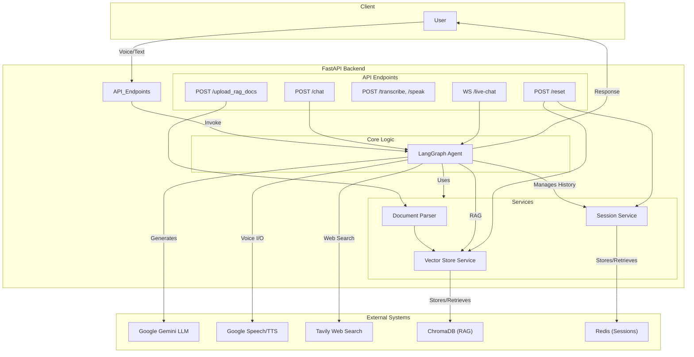

# Okada Hackathon Submission: Voice Conversational RAG Agent

This project is a submission for the Okada Hackathon, featuring a sophisticated, voice-enabled conversational AI agent with Retrieval Augmented Generation (RAG) capabilities, persistent session management, and toggleable web search.

## Core Features

*   Real-Time Voice Conversation: Engage in seamless, bi-directional voice conversations via a WebSocket endpoint.
*   Retrieval Augmented Generation (RAG): Upload documents (PDF, DOCX, TXT, CSV) to a dedicated endpoint, and the agent will use them as a knowledge base to answer questions.
*   Toggleable Web Search: Dynamically enable or disable real-time web search to provide the agent with up-to-date information.
*   Persistent Session Management: Conversation history is stored in Redis, allowing the agent to maintain context across multiple interactions within a session.
*   Production-Grade Reset: A dedicated endpoint clears both the conversation history from Redis and the associated RAG documents from the ChromaDB vector store for a clean reset.
*   Comprehensive API: A full suite of RESTful endpoints for chat, document upload, transcription, text-to-speech, and session management, all with processing duration metrics.

## Architecture Overview

The application is built on a modern Python backend using FastAPI, LangGraph, and a suite of powerful cloud services.

*   Backend: FastAPI
*   Agent Framework: LangChain & LangGraph
*   LLM: Google Gemini
*   Speech-to-Text / Text-to-Speech: Google Cloud Speech & TTS APIs, and Gemini Live for streaming.
*   Vector Store: ChromaDB (Persistent)
*   Session Store: Redis
*   Web Search: Tavily Search API



## Setup and Running the Project

### Prerequisites

*   Python 3.9+
*   Redis server running locally or accessible via URL.
*   Google Cloud SDK authenticated with a service account that has permissions for Speech-to-Text and Text-to-Speech APIs.

### 1. Clone the Repository

```bash
git clone <repository-url>
cd okada_hackathon_rag_voice/backend
```

### 2. Set Up a Virtual Environment

```bash
python -m venv venv
source venv/bin/activate  # On Windows, use `venv\Scripts\activate`
```

### 3. Install Dependencies

The project uses `uv` for fast package management. First, install `uv`:

```bash
pip install uv
```

Then, install the project dependencies from `pyproject.toml`:

```bash
uv sync
```

### 4. Configure Environment Variables

Create a `.env` file in the `backend` directory by copying the example file:

```bash
cp .env.example .env
```

Now, edit the `.env` file and fill in your credentials:

*   `GOOGLE_API_KEY`: Your API key for Google Gemini.
*   `GOOGLE_APPLICATION_CREDENTIALS`: The absolute path to your Google Cloud service account JSON file.
*   `TAVILY_API_KEY`: (Optional) Your API key for Tavily Search.
*   `REDIS_URL`: The connection URL for your Redis instance (e.g., `redis://localhost:6379`).
        *   `services/document_parser.py`, `services/vector_store.py`
        *   `tools/web_search.py`
        *   `api/v1/endpoints/chat.py`, `api/v1/endpoints/upload.py`, `api/v1/endpoints/live_chat.py`
        *   `main.py`
    *   **Status:** **[READY FOR USER EXECUTION]**

3.  **Fix Typo in `agent/nodes.py`:**
    *   **Action:** Your senior engineer will directly fix the typo in `backend/app/agent/nodes.py`.
    *   **Expected Change:** `return "ginini"` -> `return "gemini"`.
    *   **Status:** **[PENDING AI EXECUTION]**

4.  **Implement `/reset` Endpoint (`management.py`):**
    *   **Action:** Your senior engineer will create `backend/app/api/v1/endpoints/management.py` and implement the endpoint logic.
    *   **Details:** A `POST` endpoint accepting `session_id`, returning a success message and `processing_duration`.
    *   **Status:** **[PENDING AI EXECUTION]**

5.  **Add Processing Durations to Existing Endpoints (Phase 1):**
    *   **Action:** Your senior engineer will modify `chat.py` and `upload.py` to calculate and include `processing_duration` in their JSON responses.
    *   **Status:** **[PENDING AI EXECUTION]**

### **Phase 2: New Core Functionality & Integration (Estimated Time: 3-4 hours)**

*   **Importance:** High (Delivers the remaining critical API endpoints as per requirements)
*   **Difficulty:** Medium to High (Requires new API client integrations)
*   **Goal:** Implement dedicated STT and TTS endpoints, update the main app to include new routes, and define all project dependencies.

1.  **Implement `/transcribe POST` and `/speak POST` Endpoints (`audio.py`):**
    *   **Action:** Your senior engineer will create `backend/app/api/v1/endpoints/audio.py` and implement both endpoints.
    *   **Details:** Integration with `google-cloud-speech` and `google-cloud-texttospeech` libraries for dedicated STT and TTS, returning respective `_time` metrics.
    *   **Status:** **[PENDING AI EXECUTION]**

2.  **Add Processing Durations to Existing Endpoints (Phase 2):**
    *   **Action:** Your senior engineer will add timing to `live_chat.py` (consider overall session setup time, or average chunk processing latency for streaming) and include it in response/logging.
    *   **Status:** **[PENDING AI EXECUTION]**

3.  **Update `main.py`:**
    *   **Action:** Your senior engineer will modify `backend/app/main.py` to import and include the newly created `audio` and `management` routers.
    *   **Status:** **[PENDING AI EXECUTION]**

4.  **Define Dependencies (`requirements.txt`):**
    *   **Action:** Your senior engineer will create `backend/requirements.txt` listing all necessary Python packages.
    *   **Status:** **[PENDING AI EXECUTION]**

5.  **Create Environment Variables Example (`.env.example`):**
    *   **Action:** Your senior engineer will create `backend/.env.example` with placeholders for all required API keys and settings.
    *   **Status:** **[PENDING AI EXECUTION]**

### **Phase 3: Refinements, Polish & Presentation (Estimated Time: 1 hour)**

*   **Importance:** Medium (Enhances presentation, robustness, and overall impact)
*   **Difficulty:** Low
*   **Goal:** Solidify presentation arguments, perform final checks, and prepare supplementary materials for a winning submission.

1.  **Confirm `/converse` Strategy (Presentation Prep):**
    *   **Action:** We will collectively finalize the clear and confident argument for using our WebSocket `/ws/v1/live-chat` as the robust fulfillment of the `/converse` requirement.
    *   **Status:** **[PENDING DISCUSSION]**

2.  **JSON Document Handling Test (Optional but Recommended):**
    *   **Action:** If time permits, we'll perform a quick manual test by uploading a sample `.json` file via `/api/v1/upload` to ensure it's correctly processed for RAG.
    *   **Status:** **[PENDING MANUAL TEST]**

3.  **Final `README.md` Details & Architecture Diagram:**
    *   **Action:** I will help you generate the Mermaid architecture diagram to embed directly into the `README.md`. We will ensure setup and usage instructions are crystal clear.
    *   **Status:** **[PENDING AI EXECUTION]**

---

**Confidence:** With this detailed plan, we are set up for success. We're directly addressing every requirement, planning for robustness, and optimizing for the hackathon timeline by leveraging your existing strong foundation.

**Are you ready to proceed with Phase 1, Step 2: Copy Core Reusable Files (Manual by User)? Please confirm when you've copied the files, and we'll move on to my first code edit!** 