# Okada Hackathon Submission 2025 Voice-Enabled Conversational RAG Agent

> _"Ask it anything – by voice – and watch it reason across your private docs **and** the live web."_


---

## Table of Contents
1. [Project Highlights](#project-highlights)
2. [Live Demo](#live-demo)
3. [Quick-Start](#quick-start)
   1. [Backend](#backend)
   2. [Frontend](#frontend)
4. [System Architecture](#system-architecture)
5. [API Reference](#api-reference)
6. [Environment Variables](#environment-variables)
7. [Repository Layout](#repository-layout)
8. [License](#license)

---

## Project Highlights

| Category | Details |
|----------|---------|
| **Conversational Modality** | Bi-directional **voice** & text (WebSocket stream) |
| **Knowledge Source** | Retrieval Augmented Generation on user-uploaded PDFs, DOCX, CSV, TXT |
| **LLM** | Google **Gemini 1.5 Pro** (via LangGraph) |
| **Web Search** | Toggleable real-time search with Tavily API |
| **Persistence** | Redis (chat history) • ChromaDB (vector store) |
| **Observability** | Every endpoint returns `processing_duration` (ms) |
| **Reset** | One-shot `/reset` clears both Redis & ChromaDB |
| **Tech Stack** | FastAPI • LangGraph • Vite + React 19 • TailwindCSS |

---

## Live Demo

| Action | URL / Command |
|--------|---------------|
| REST playground | `http://localhost:8000/docs` |
| WebSocket voice chat | `ws://localhost:8000/ws/v1/live-chat` |
| Frontend SPA | `http://localhost:5173` |

---

## Quick-Start

### Backend

```bash
# 1. clone & enter repository
$ git clone <your-fork-url>
$ cd okada_hackathon_rag_voice/backend

# 2. python environment
$ python -m venv .venv && source .venv/bin/activate             # Windows: .venv\Scripts\activate

# 3. install deps with lightning-fast uv
$ pip install uv && uv sync                                      # falls back to pip if uv unavailable

# 4. create & fill .env
$ cp .env.example .env                                           # see table below for keys

# 5. run server
$ uvicorn app.main:app --reload --port 8000
```

### Frontend

```bash
$ cd ../frontend
$ npm i          # or pnpm / yarn
$ npm run dev    # open http://localhost:5173
```

> The SPA expects the backend base-url in `VITE_API_URL` (defaults to `http://localhost:8000`).

---

## System Architecture

```mermaid
graph TD
    subgraph Client
        User((🎤))
        UI[React 19 SPA]
    end

    subgraph "FastAPI Backend"
        direction LR
        Chat["POST /chat"]
        Upload["POST /upload_rag_docs"]
        Audio["POST /transcribe • /speak"]
        Reset["POST /reset"]
        LiveChat["WS /live-chat"]
        Chat & Upload & Audio & Reset & LiveChat --> Agent((LangGraph ↔ Gemini))
    end

    subgraph Persistence
        Chroma[(ChromaDB)]
        Redis[(Redis)]
    end

    Agent -- RAG --> Chroma
    Agent -- Sessions --> Redis
    Agent -- Web Search --> Tavily[Tavily API]
    Agent -- STT / TTS --> GoogleCloud[Google Speech API]

    UI -- voice/text --> LiveChat
    Upload --> Chroma
    Reset --> Redis & Chroma
    Agent -- reply --> UI
```



---

## API Reference (v1)

| Endpoint | Verb | Description |
|----------|------|-------------|
| `/api/v1/chat` | `POST` | Single-shot chat completion |
| `/api/v1/upload_rag_docs` | `POST` | Upload one or more documents (PDF/DOCX/TXT/CSV) for RAG |
| `/api/v1/transcribe` | `POST` | Speech-to-Text for pre-recorded audio |
| `/api/v1/speak` | `POST` | Text-to-speech synthesis |
| `/api/v1/reset` | `POST` | Clears Redis history & related vector chunks |
| `/ws/v1/live-chat` | `WEBSOCKET` | Full-duplex streaming voice chat |

Each JSON response contains:
```json
{
  "message": "...",
  "processing_duration": 1234  //- ms
}
```

---

## Environment Variables
| Variable | Purpose |
|----------|---------|
| `GOOGLE_API_KEY` | Gemini access |
| `GOOGLE_APPLICATION_CREDENTIALS` | Path to GCP service-account JSON |
| `TAVILY_API_KEY` | (Optional) Web search |
| `REDIS_URL` | e.g. `redis://localhost:6379/0` |
| `CHROMA_PERSIST_DIR` | Folder for ChromaDB persistence |
| `VITE_API_URL` | Frontend ⇄ Backend base-url |

See `.env.example` for a complete reference.

---

## Repository Layout

```
├── backend
│   ├── app
│   │   ├── api
│   │   ├── agent
│   │   └── services
│   ├── .env.example
│   └── pyproject.toml
├── frontend
│   ├── src
│   ├── public
│   └── package.json
└── docs (screenshots, diagrams)
```

---

## License
MIT ― free for educational & research use.
