```mermaid
graph TD
    subgraph "User Interface (intellig-chat-ui)"
        direction LR
        UI[React Frontend] -->|API Calls| Gateway(API Gateway)
        UI -->|WebSocket| LiveChat(Live Chat WS)
    end

    subgraph "Backend (okada_hackathon_voice_conversational_agent)"
        direction TB
        Gateway --> Endpoints
        LiveChat --> Agent

        subgraph "API Endpoints (app/api/v1/endpoints)"
            direction LR
            Endpoints[ ]
            Endpoints --> chat.py
            Endpoints --> audio.py
            Endpoints --> appointment.py
            Endpoints --> history.py
            Endpoints --> upload.py
            Endpoints --> user_management.py
            Endpoints --> health.py
            Endpoints --> management.py
        end

        chat.py --> Agent
        audio.py --> Agent
        live_chat.py --> Agent

        subgraph "Conversational Agent (app/agent)"
            direction TB
            Agent[Agent Graph Logic]
            Agent -- Manages --> AgentState(State)
            Agent -- Composed of --> AgentNodes(Nodes)
        end

        Agent --> Services

        subgraph "Backend Services (app/services)"
            direction TB
            Services[ ]
            subgraph "Core Workflows"
                direction LR
                AppointmentWorkflow(appointment_workflow.py)
                RecommendationWorkflow(recommendation_workflow.py)
            end
            subgraph "AI/NLP Services"
                direction LR
                MessageClassifier(fast_message_classifier.py)
                ResponseGenerator(strict_response_generator.py)
                DocumentParser(document_parser.py)
            end
            subgraph "Data Stores"
                direction LR
                VectorStore(vector_store.py)
                DBService(database_service.py)
                HistoryService(persistent_history_service.py)
            end
            subgraph "External Integrations"
                direction LR
                Calendar(calendar_service.py)
                CRM(crm_service.py)
                GoogleMeet(google_meet_service.py)
            end
            Services --> CoreWorkflows
            Services --> AIServices
            Services --> DataStores
            Services --> ExternalIntegrations
        end

        appointment.py --> AppointmentWorkflow
        Agent --> RecommendationWorkflow
        Agent --> MessageClassifier
        Agent --> ResponseGenerator
        upload.py --> DocumentParser
        Agent --> VectorStore
        Agent --> DBService
        history.py --> HistoryService
        AppointmentWorkflow --> Calendar
        AppointmentWorkflow --> CRM
        AppointmentWorkflow --> GoogleMeet
    end

    classDef frontend fill:#D6EAF8,stroke:#2E86C1,stroke-width:2px;
    classDef backend fill:#E8DAEF,stroke:#8E44AD,stroke-width:2px;
    classDef api fill:#D1F2EB,stroke:#16A085,stroke-width:2px;
    classDef agent fill:#FCF3CF,stroke:#F1C40F,stroke-width:2px;
    classDef services fill:#FADBD8,stroke:#C0392B,stroke-width:2px;

    class UI,Gateway,LiveChat frontend;
    class Endpoints,chat.py,audio.py,live_chat.py,appointment.py,history.py,upload.py,user_management.py,health.py,management.py api;
    class Agent,AgentState,AgentNodes agent;
    class Services,CoreWorkflows,AIServices,DataStores,ExternalIntegrations,AppointmentWorkflow,RecommendationWorkflow,MessageClassifier,ResponseGenerator,DocumentParser,VectorStore,DBService,HistoryService,Calendar,CRM,GoogleMeet services;
```

### Explanation of the Diagram:

*   **User Interface (`intellig-chat-ui`)**: This is the client-side application that the user interacts with. It's built with React and is responsible for rendering the chat interface and handling user input. It communicates with the backend via standard HTTP requests and receives real-time updates through a WebSocket connection.

*   **Conversational Agent (`okada_hackathon_voice_conversational_agent`)**: This is the server-side application that contains the core logic.
    *   **Backend API**: This is the entry point for the frontend. It receives requests and sends responses.
    *   **Agent Logic**: This is the central part of the backend that processes user messages, manages the conversation flow, and interacts with other components.
    *   **State Management**: This component keeps track of the conversation state, such as user information and conversation history.
    *   **LLM/NLP Service**: This represents the connection to a Large Language Model (like GPT) or other Natural Language Processing services that provide the core conversational capabilities.
    *   **Vector Database**: This is likely used for Retrieval-Augmented Generation (RAG), where relevant documents are retrieved based on the user's query to provide more contextually accurate answers.
*   **WebSocket**: This allows for real-time, bidirectional communication between the frontend and the backend, which is essential for a smooth chat experience.
